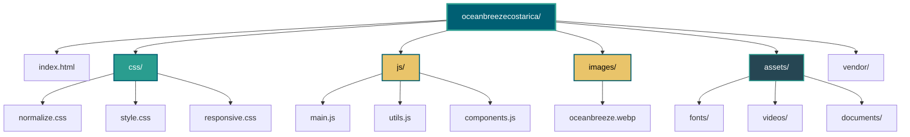

# Ocean Breeze Costa Rica 🌊

Sitio web profesional para Ocean Breeze Costa Rica, una empresa especializada en tours inolvidables y transporte premium en Guanacaste, Costa Rica.

## 📋 Descripción

Ocean Breeze Costa Rica es una plataforma web moderna y responsiva diseñada para mostrar los servicios de tours y transporte turístico en la hermosa región de Guanacaste. El sitio presenta una experiencia visual atractiva con un hero section impactante, secciones informativas sobre servicios, y un diseño completamente responsive.

## ✨ Características

- **Diseño Moderno y Responsive**: Adaptado para todos los dispositivos (móviles, tablets, escritorio)
- **Hero Section Impactante**: Imagen de fondo con overlay y call-to-action buttons
- **Navegación Suave**: Scroll suave entre secciones y navbar que cambia al hacer scroll
- **Animaciones**: Integración con AOS (Animate On Scroll) para efectos visuales
- **Formulario de Contacto**: Validación y manejo de formularios
- **Botón WhatsApp Flotante**: Acceso directo para contacto vía WhatsApp
- **Optimización**: Código separado y organizado para fácil mantenimiento

## 🛠️ Tecnologías Utilizadas

- **HTML5**: Estructura semántica
- **CSS3**: Estilos personalizados con variables CSS
- **JavaScript (Vanilla)**: Sin dependencias de frameworks
- **Bootstrap 5.3.0**: Framework CSS para componentes responsive
- **Font Awesome 6.4.0**: Iconografía
- **AOS (Animate On Scroll)**: Librería de animaciones
- **Google Fonts (Poppins)**: Tipografía personalizada

## 📁 Estructura del Proyecto



## 📂 Descripción de Archivos

### Archivos Principales

- **`index.html`**: Página principal del sitio web con toda la estructura HTML

### CSS (`/css`)

- **`normalize.css`**: Reset CSS para normalizar estilos entre navegadores
- **`style.css`**: Estilos principales del sitio (variables CSS, navbar, hero, cards, footer, etc.)
- **`responsive.css`**: Media queries para diseño responsive en diferentes tamaños de pantalla

### JavaScript (`/js`)

- **`main.js`**: 
  - Inicialización de AOS (Animate On Scroll)
  - Manejo del navbar scroll effect
  - Smooth scroll para enlaces de anclaje
  
- **`utils.js`**: 
  - Funciones auxiliares reutilizables
  - Validación de email
  - Formateo de teléfonos
  - Sistema de notificaciones
  - Funciones debounce y throttle para optimización
  
- **`components.js`**: 
  - Manejo del formulario de contacto
  - Inicialización del botón WhatsApp
  - Funcionalidad del scroll indicator

### Imágenes (`/images`)

- **`oceanbreeze.webp`**: Logo de la empresa

### Assets (`/assets`)

- **`fonts/`**: Carpeta para fuentes personalizadas (si se requieren)
- **`videos/`**: Carpeta para videos del sitio
- **`documents/`**: Carpeta para documentos PDF (folletos, catálogos, etc.)

### Vendor (`/vendor`)

- Carpeta reservada para librerías de terceros descargadas localmente (si se requiere)

## 🚀 Instalación y Uso

### Requisitos Previos

No se requieren dependencias adicionales. El proyecto utiliza CDN para todas las librerías externas.

### Pasos para Ejecutar

1. **Clonar o descargar el proyecto**
   ```bash
   git clone [url-del-repositorio]
   cd oceanbreezecostarica
   ```

2. **Abrir en el navegador**
   - Simplemente abre el archivo `index.html` en tu navegador web preferido
   - O usa un servidor local:
     ```bash
     # Con Python
     python -m http.server 8000
     
     # Con Node.js (http-server)
     npx http-server
     
     # Con PHP
     php -S localhost:8000
     ```

3. **Acceder al sitio**
   - Abre tu navegador y ve a `http://localhost:8000`

## 🎨 Personalización

### Variables CSS

Puedes personalizar los colores del sitio modificando las variables en `css/style.css`:

```css
:root {
    --primary-blue: #005f73;    /* Azul Océano */
    --primary-green: #2a9d8f;   /* Verde Palma */
    --accent-sand: #e9c46a;     /* Arena */
    --dark-text: #264653;
    --light-bg: #f8f9fa;
}
```

### Imagen de Fondo del Hero

Para cambiar la imagen de fondo del hero section, modifica la URL en `css/style.css`:

```css
.hero {
    background: linear-gradient(rgba(0,0,0,0.3), rgba(0,0,0,0.3)), 
                url('tu-imagen-aqui.jpg');
}
```

### Información de Contacto

Actualiza la información de contacto en `index.html`:
- Teléfono: Línea 378
- Email: Línea 379
- WhatsApp: Línea 421 (enlace del botón flotante)

## 📱 Secciones del Sitio

1. **Hero Section**: Presentación principal con título, subtítulo y botones CTA
2. **Tours**: Muestra los diferentes tipos de tours disponibles
3. **Transporte**: Información sobre el servicio de transporte privado
4. **Nosotros**: Descripción de la empresa
5. **Testimonios**: Testimonios de clientes satisfechos
6. **Galería**: Galería de imágenes
7. **Contacto**: Formulario de contacto e información de contacto

## 🔧 Funcionalidades JavaScript

### Navbar Scroll Effect
El navbar cambia de estilo cuando el usuario hace scroll, mejorando la visibilidad.

### Smooth Scroll
Navegación suave entre secciones al hacer clic en los enlaces del menú.

### Formulario de Contacto
- Validación de campos requeridos
- Validación de formato de email
- Mensajes de notificación al usuario

### Animaciones AOS
Elementos que aparecen con animación al hacer scroll, mejorando la experiencia visual.

## 🌐 Compatibilidad de Navegadores

- Chrome (últimas versiones)
- Firefox (últimas versiones)
- Safari (últimas versiones)
- Edge (últimas versiones)
- Opera (últimas versiones)

## 📝 Notas de Desarrollo

- El proyecto está estructurado de forma modular para facilitar el mantenimiento
- Todos los estilos están separados en archivos CSS específicos
- El JavaScript está organizado por funcionalidad
- Se utiliza normalize.css para garantizar consistencia entre navegadores

## 📄 Licencia

Este proyecto es propiedad de Ocean Breeze Costa Rica. Todos los derechos reservados.

## 👥 Contacto

Para más información sobre Ocean Breeze Costa Rica:
- **Email**: info@oceanbreeze.cr
- **Teléfono**: +506 8888-8888
- **Ubicación**: Guanacaste, Costa Rica

---

## 🏢 Desarrollo

Este proyecto fue desarrollado por **[Manakin Labs](https://www.manakinlabs.com)**

Visita nuestro sitio web: [www.manakinlabs.com](https://www.manakinlabs.com)

---


